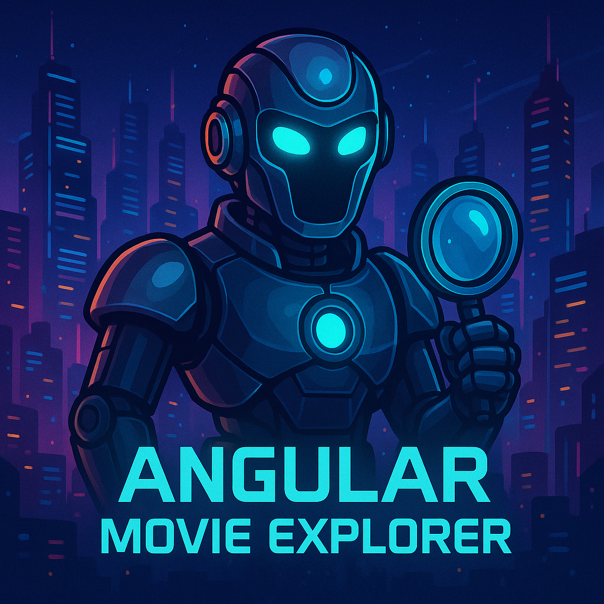
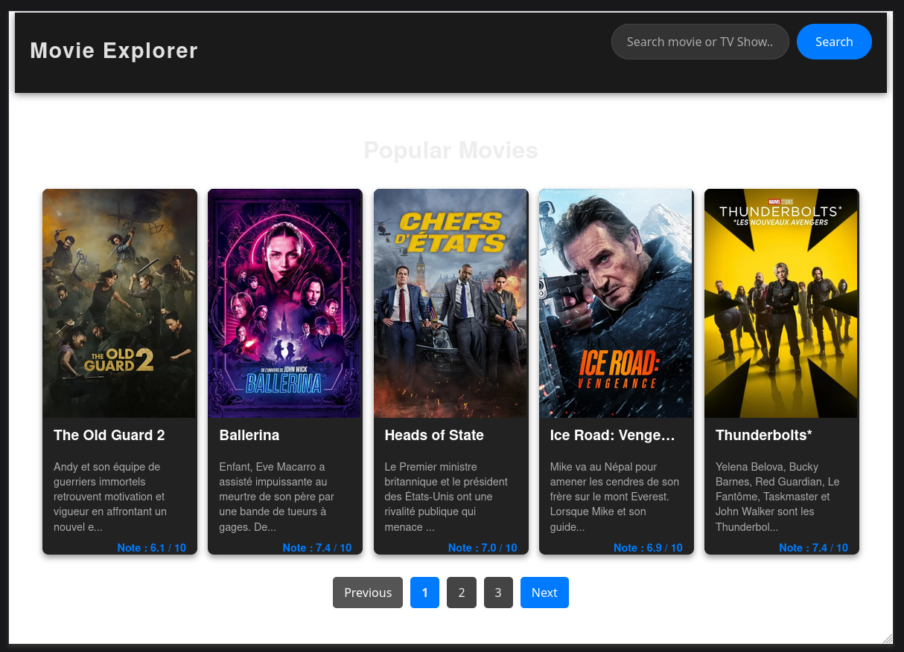
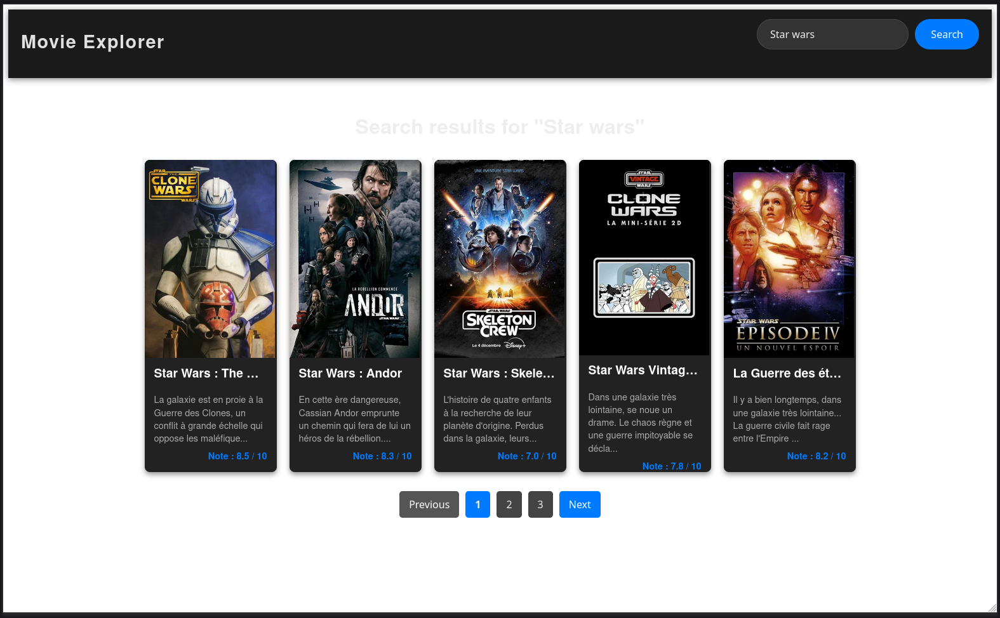
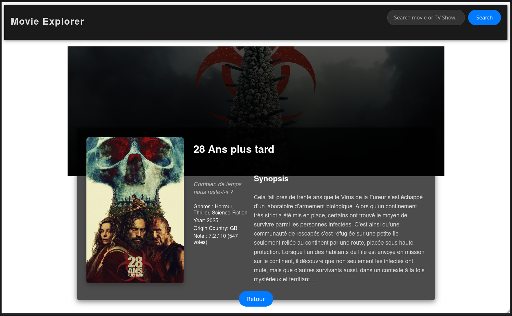

<div align="center" id="top"> 
  
</div>

<h1 align="center" style="text-align: center; font-size: xxx-large">Angular Movie Explorer</h1>

<p align="center" style="width: 100%; display: flex; justify-content: center; gap: 5px">
  

  

  

  

</p>
<br>
<p align="center" style="width: 100%; display: flex; justify-content: center; gap: 5px">

   
  
  

  

  

  

</p>

<p align="center" style="width: 100%; display: flex; justify-content: center; gap: 5px">
  

  

  

  </p>

<!-- Status -->

<hr>

<p align="center" style="width: 100%; display: flex; justify-content: center; gap: 5px; font-size: small">
  <a href="#dart-about">About</a> &#xa0; | &#xa0; 
  <a href="#sparkles-features">Features</a> &#xa0; | &#xa0;
  <a href="#rocket-technologies">Technologies</a> &#xa0; | &#xa0;
  <a href="#white_check_mark-requirements">Requirements</a> &#xa0; | &#xa0;
  <a href="#checkered_flag-starting">Starting</a> &#xa0; | &#xa0;
  <a href="#tv-preview">Preview</a> &#xa0; | &#xa0;
  <a href="#memo-license">License</a> &#xa0; | &#xa0;
  <a href="https://github.com/Pouish85" target="_blank">Author</a>
</p>

<br>

## :dart: About

This project is an **Angular web application** designed to explore and discover movies and TV shows. It will leverage the **TMDB (The Movie Database) API** to fetch comprehensive data. This is my very first project developed with the Angular framework, serving as a hands-on learning experience to grasp its core concepts and best practices for modern frontend development.

## :sparkles: Features

- :heavy_check_mark: **Popular Movies Exploration** : Easily browse the latest trending movies.
- :heavy_check_mark: **Intuitive Search Functionality** : Quickly find movies or TV shows by title using a responsive search bar.
- :heavy_check_mark: **Detailed Media Information** : View comprehensive details for each movie or TV show (overview, rating, genres, release date, etc.).
- :heavy_check_mark: **Smooth Pagination Navigation** : Effortlessly navigate through large collections of media with efficient pagination controls.
- :heavy_check_mark: **Loading Indicators** : Enhanced user experience with visible spinners during data fetching.
- :heavy_check_mark: **Responsive User Interface** : Enjoy an adaptive and pleasant application experience across all devices (desktops, tablets, mobile phones).
- :heavy_check_mark: **Reusable Components** : Modular architecture built with Angular components for improved maintainability.
- :heavy_check_mark: **API Data Handling** : Seamless integration and manipulation of data from The Movie Database (TMDB) API.

## :rocket: Technologies

The following tools were used in this project:

- [Angular](https://angular.io/)
- [Angular CLI](https://angular.io/cli)
- [TypeScript](https://www.typescriptlang.org/)
- [Sass (SCSS)](https://sass-lang.com/)
- [The Movie Database (TMDB) API](https://developer.themoviedb.org/docs)

## :white_check_mark: Requirements

Before starting :checkered_flag:, you need to have [Git](https://git-scm.com), [Node.js](https://nodejs.org/) (which includes npm), and [Angular CLI](https://angular.io/cli) installed.

## :checkered_flag: Starting

To get this project up and running on your local machine, follow these steps.

```bash
# Clone this repository
$ git clone git clone https://github.com/Pouish85/angular-movie-explorer

# Navigate into the project directory
$ cd angular-movie-explorer

# Install the project dependencies
$ npm install
```

## Development server

To start a local development server, run:

```bash
ng serve
```

Once the server is running, open your browser and navigate to `http://localhost:4200/`. The application will automatically reload whenever you modify any of the source files.

## Building for Production

To build the project for deployment, run:

```bash
ng build
```

The compiled build artifacts will be stored in the dist/ directory.

## :tv: Preview

<div align="center">
  <h3>Home Page (Popular Movies)</h3>
  
</div>

<br>

<div align="center">
  <h3>Search Results</h3>
  
</div>

<br>

<div align="center">
  <h3>Item Detail Page</h3>
  
</div>

## :memo: License

This project is under license from MIT. For more details, see the [LICENSE](LICENSE) file.

Made with :heart: by <a href="https://github.com/Pouish85" target="_blank">Pouish85</a>

&#xa0;

<a href="#top">Back to top</a>
